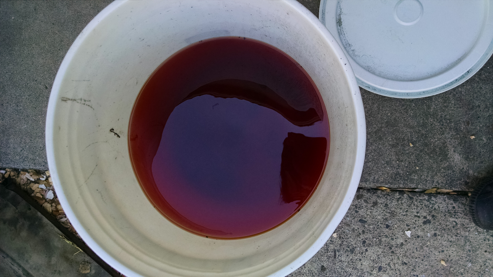

## 2015-10-09 qjhart 2hrs

First day of working on the Jeepster renovation.  My goal is just to get the old fluids, and junk to the hazardous waste site over the weekend.

First, I drained the gas.  There still was about 3 gallons in the tank.  It came out a beautiful red color, and wasn't too sedimenty until the very end.  Have see a few differenet methods of cleaning the tank.  Will remove it once I figure out the locked gas cap

Next drained about 4 qts of blueish oil from the engine, and then about 3 quarts of normal looking radiator fluid.  Still need to look at the brakes, and remove the oil filter, gas filter, spark plugs.
