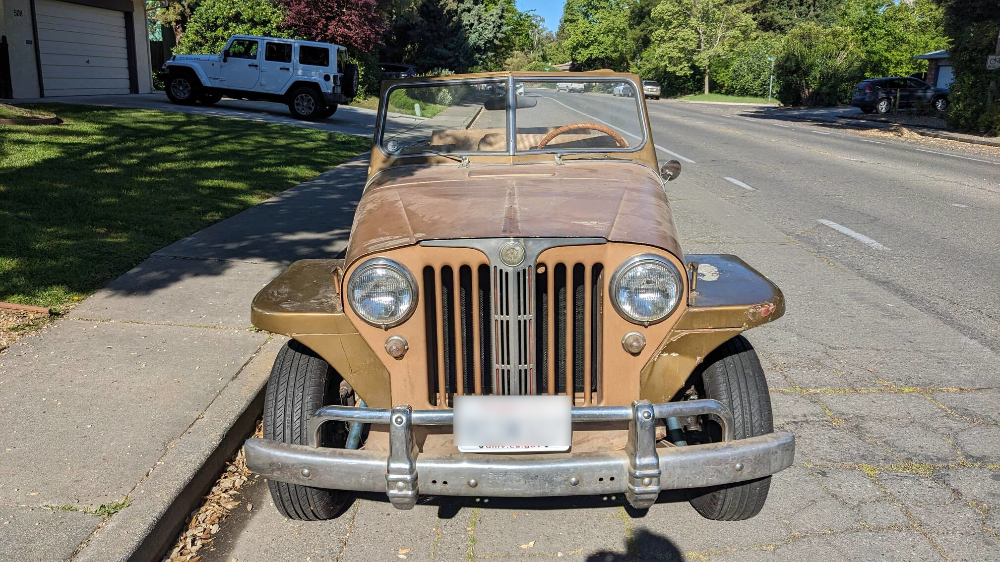

# Table of Contents

1.  [Overview](#orgd5fc0d0)

# Overview

This car belonged to my wife thoughout high-school in the 80&rsquo;s, (It still has
 HS [Parking Sticker](parking_sticker.jpg)) When she went to college it was given to a family friend
who put it in their garage and forgot about it.  30 years later, they reached
out,and gave it back to us. We&rsquo;ve done pretty much the same for the last ten
years as well, but we have made enough repairs to get it up and running around
the town.

The original color was fire engine red, but it&rsquo;s been painted at least twice
since then.  In some of the pictures, it looks patinaed, but really it&rsquo;s more of
a copper color paint that hasn&rsquo;t been renewed.

<table border="2" cellspacing="0" cellpadding="6" rules="groups" frame="hsides">

<colgroup>
<col  class="org-left" />

<col  class="org-left" />

<col  class="org-left" />

<col  class="org-left" />
</colgroup>
<tbody>
<tr>
<td class="org-left"></td>
<td class="org-left"></td>
<td class="org-left"></td>
<td class="org-left"></td>
</tr>

<tr>
<td class="org-left"></td>
<td class="org-left"></td>
<td class="org-left"></td>
<td class="org-left"></td>
</tr>
</tbody>
</table>

